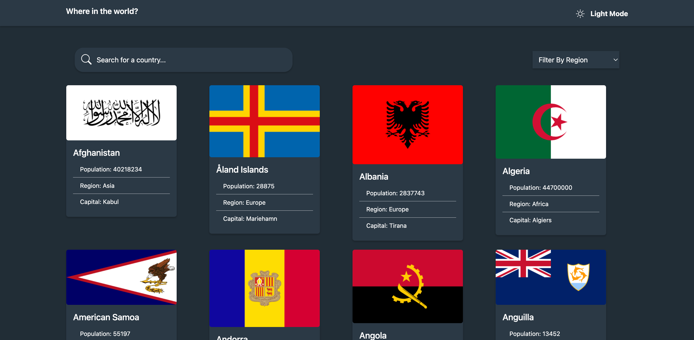

## Overview

### What I buit

A countries-list web application where users are able to:

- See all countries from the API on the homepage
- Search for a country using an `input` field
- Filter countries by region
- Click on a country to see more detailed information on a separate page
- Click through to the border countries on the detail page
- Toggle the color scheme between light and dark mode

### Screenshot

### Links

- Github URL: (https://github.com/Fransco35/rest-countries-react-app)
- Live Site URL: [Add live site URL here](https://rest-countries-reactjs.vercel.app)

### Built with

- Semantic HTML5 markup
- CSS custom properties
- Bootstrap
- Desktop-first workflow
- React.js
- React-router-dom

### Useful Notes

- I first of all used the data.json() in the folder structure to make my API calls before using the Rest Countries API. This enabled me setup the project quicker and I avoided making too many unnecessary API calls
- The API is currently running in V3.1 so I reverted to V2 because it had the matching key value pairs that matched the data.json() file
- I made a lot of comments in my functions to enable readers understand them and my thought process. Please read them along with the code for fast and easy understanding.
- For some countries,there are some keys with empty values in them e.g the border countries key value pair. My workaround was to first of all check if the values are available. If the value returns true then i'll render it, else if it is false I'll render a text which says "not included"

### Continued development

State management in this project can also be handled using the react Context API. This is mostly in relation to the theme-switch toggler because it handles an App wide state. State was lifted up and passed down through several components and using the Context API will simplify the workflow.

## Author

- Website - (https://www.francisinegbenose.vercel.app)
- Frontend Mentor - (https://www.frontendmentor.io/profile/Fransco35)
- Linkedin - (https://www.linkedin.com/in/francis-inegbenose)
